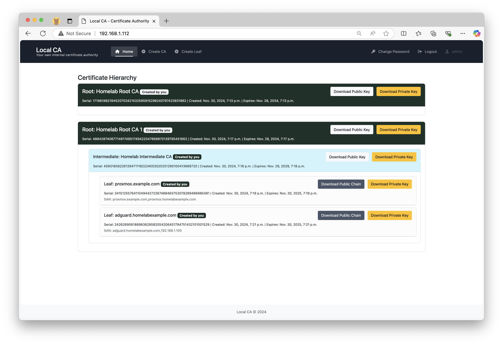
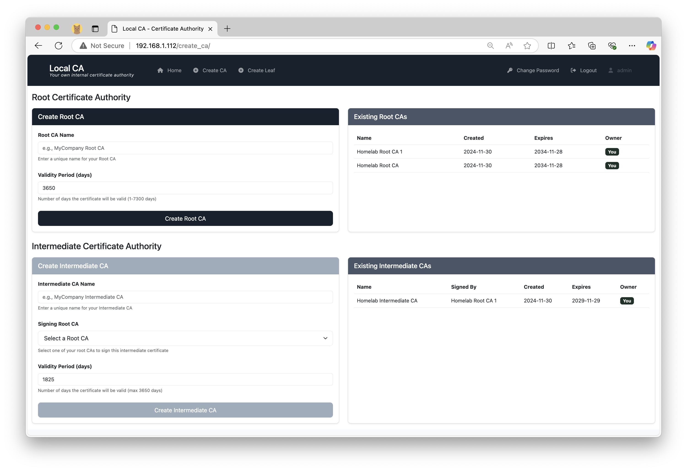
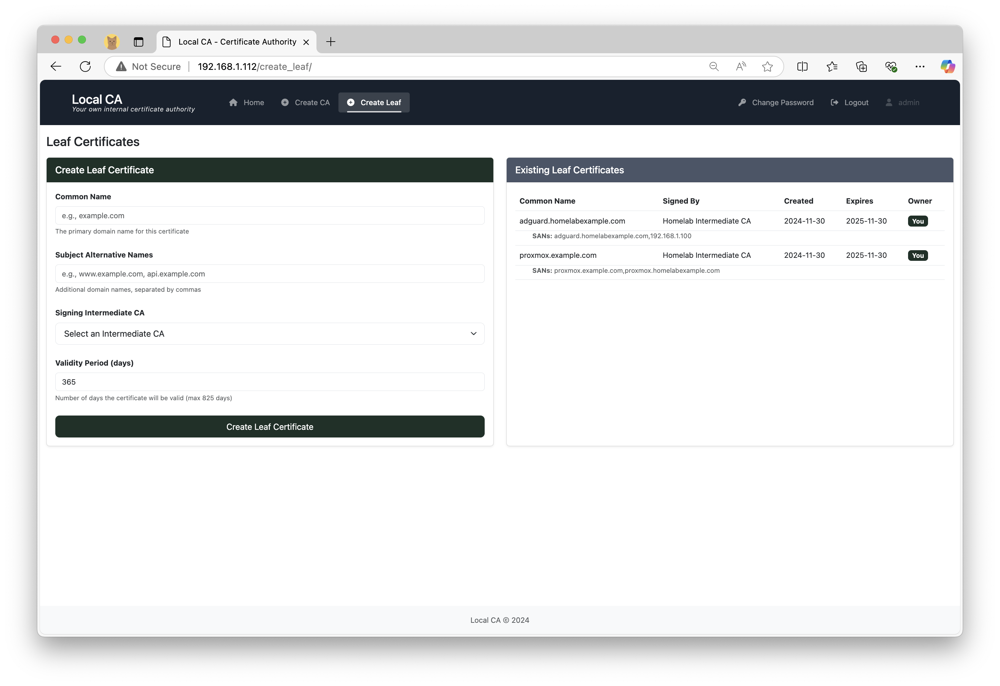

# Local CA 
Local Certificate Authority 

## Introduction

Welcome to Local CA!  

Local CA is a self hosted certificate authority that allows you to build your own PKI infrastructure locally or in your homelab or home network. Say goodbye to those pesky HTTPS INSECURE  warnings when accessing locally hosted web services! 
You can use the intuitive python flask based web GUI to create root certificates, intermediate certificates and leaf/end user certificates to secure your services. 

With the certificates generated by Local CA, you can add HTTPs to your local instances Proxmox, Adguard Home, Pi Hole, Jellyfin, Grafana etc. 

### Features
- Create root, intermediate and leaf certificates. The root certificate is self signed, and you need to install it in your browser or client devices as a one time setup.  
- You can host the app locally and use the web UI to download certificates. 
- Simple and lightweight deployment using docker
- This is a great learning tool to understand TLS/PKI by creating and installing your own certificates. 

### Screenshots 
  
*Certificates generated page*


  
*Create Root CA*


  
*Create leaf/end user certs*

### Development steps
```
cd localca_project
python -m venv venv
source venv/bin/activate
cd localca_project
pip install -r requirements.txt
python manage.py makemigrations LocalCA

python manage.py migrate

python manage.py initadmin

python manage.py runserver
```

## Quick Start - Deploy with pre-built docker image from docker hub 

Run the following two commands on any directory on your linux terminal. 

```
wget https://raw.githubusercontent.com/tgangte/LocalCA/refs/heads/main/docker-compose-from-registry.yml
docker compose up 
```
Visit the IP address or 127.0.0.1 on your browser. The default username and password are _admin_ and _password_. Change this promptly upon deployment. 

And the run the following command to manage the services:

```
sudo docker compose up -d   # to start the services in the background 
sudo docker compose down # to stop the services
```

# Local build and deploy with docker

```
git clone this repo

cd into  the directory that contains the docker-compose.yml file
sudo docker compose up --build

```


