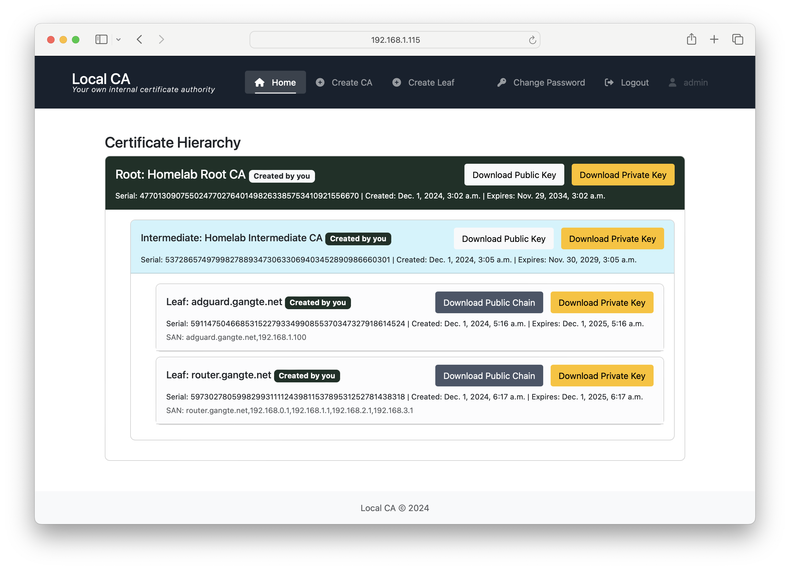
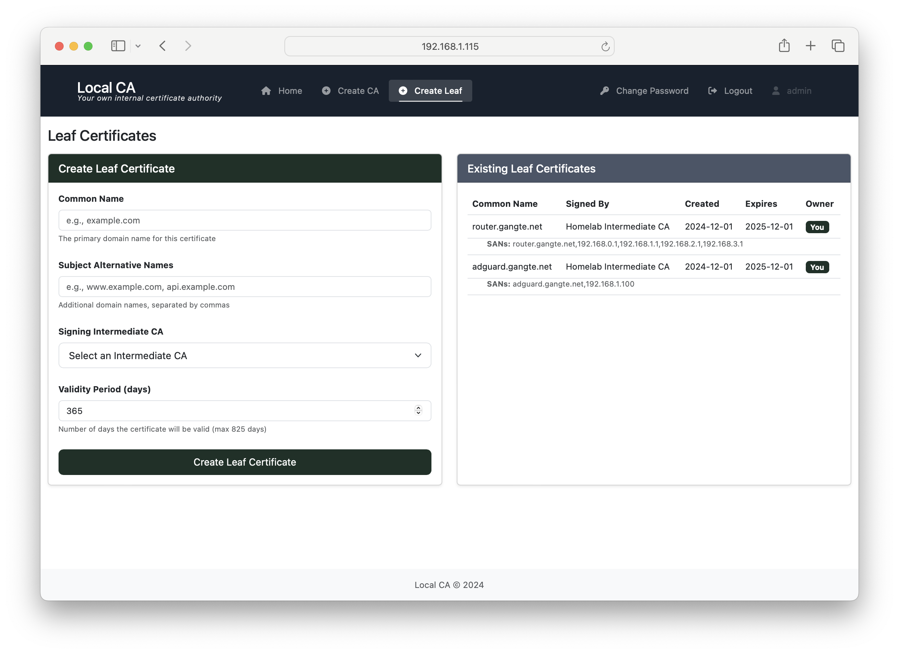
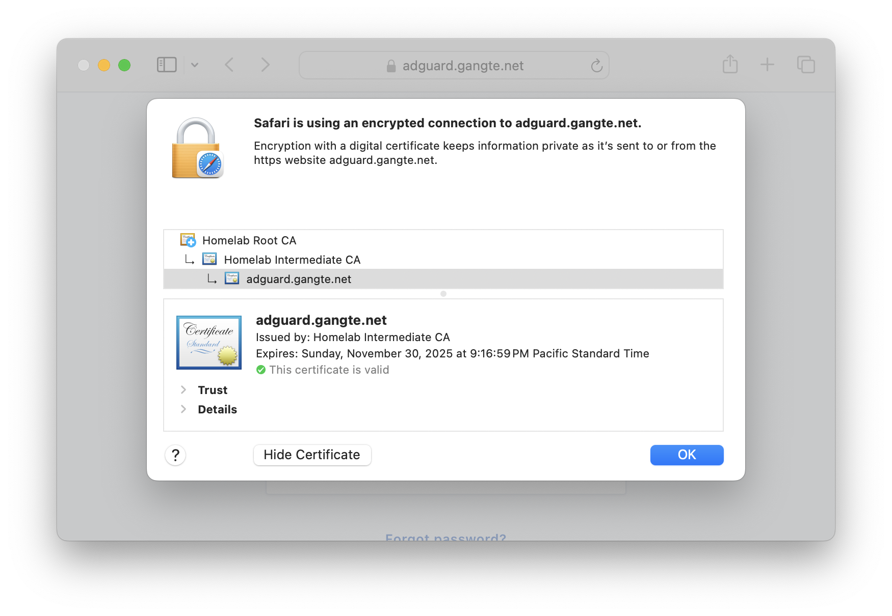

# Local CA
Local CA - Your Own Internal Certificate Authority!

[](https://github.com/tgangte/LocalCA/actions/workflows/pylint.yml)
[](https://github.com/tgangte/LocalCA/actions/workflows/django.yml)

## Welcome to Local CA!

Local CA is an open source self-hosted certificate authority that allows you to run your own [PKI infrastructure](https://en.wikipedia.org/wiki/Public_key_infrastructure) internally or in your homelab/home network.

Say goodbye to those pesky HTTPS INSECURE  warnings when browsing your locally hosted web services!
You can use the intuitive python django+bootstrap based web GUI to create and download root certificates, intermediate certificates and leaf/end user certificates to secure your services.

With the certificates generated by Local CA, you can add HTTPs to your local instances of Proxmox, Adguard Home, Pi-Hole, Jellyfin, Grafana, Homepage, [Bitwarden](https://bitwarden.com/help/certificates/#use-an-existing-ssl-certificate) etc.



### Features
- Secure your home network with HTTPS without the need for Let's Encrypt (and their complicated setup requirements).
- Create root, intermediate and leaf certificates. The root certificate is self signed, and you need to install it in your browser or client devices as a one time setup.
- Host the Local CA app locally and use the web UI to download certificates.
- Simple and lightweight deployment using docker.
- Personal branding - Name your root certificates whatever you want!
- Use in Mutual TLS (mTLS) applications.

### Screenshots


Create Root CA and Intermediate CA page


Create leaf/end user certs


Above screenshot shows an example certificate installation on my local AdguardHome instance. Safari's built in certficate explorer shows the chain of trust.

## Quick Start - Deploy with pre-built docker image from docker hub

Run the following two commands on any directory on your linux terminal to get Local CA up and running quickly.  (Note that you need to have [docker preinstalled](https://docs.docker.com/engine/install/) in your system). Do not expose this web app to the internet, it is for local use only.

```
wget https://raw.githubusercontent.com/tgangte/LocalCA/refs/heads/main/docker-compose-from-registry.yml
docker compose -f docker-compose-from-registry.yml up
```
Note that if you are using a domain name or IP address to access, you need to add that in the CSRF section of docker-compose-from-registry.yml 

Visit the host's IP address or localhost IP [127.0.0.1](http://127.0.0.1/) on your browser. The default username and password are _admin_ and _password_. Change this promptly upon deployment.

Alternatively, if you are on ARM architecture such as the Raspberry Pi or Apple Silicon (M1,M2,M3,M4 Mac etc) the you can use the  arm based docker files:
```
wget https://raw.githubusercontent.com/tgangte/LocalCA/refs/heads/main/docker-compose-from-registry-arm.yml
docker compose -f docker-compose-from-registry-arm.yml up

```
This is the docker hub repository https://hub.docker.com/r/practicalsre/local-ca/tags 

The following commands can be used to manage the services:

```
# To start the services in the background, -d runs it in detached (background) mode, so it frees up the terminal.
docker compose -f docker-compose-from-registry.yml  up -d

# To stop the services
docker compose -f docker-compose-from-registry.yml  down
```

### Local build and deploy with docker

```
# Clone this repo
git clone https://github.com/tgangte/LocalCA.git

# cd into  the directory that contains the docker-compose.yml file
cd LocalCA

# Run the docker compose build command, this will build and bring 'up' the app.
sudo docker compose up --build

# Once build is satisfactory, run these to push to docker hub
docker build -t practicalsre/local-ca:latest .
docker push practicalsre/local-ca

# Build steps for nginx for arm image
docker build -t practicalsre/local-ca-nginx:arm-latest -f Dockerfile.nginx .
docker push practicalsre/local-ca-nginx:arm-latest   
```
### Security

The web login page and passwords are protected by django-admin and hashed respectively. I recommend creating and deploying HTTPS certs for the LocalCA nginx webserver itself. 
The public and private keys are stored in the unencrypted db.sqlite3 database file, so access to this file must be restricted and the host hardened. 

Since the private keys are not encrypted, I only recommend hosting this internally, not on production or exposed to internet. 

### Development steps
```bash
git clone https://github.com/tgangte/LocalCA.git
cd LocalCA
python3 -m venv venv
source venv/bin/activate
pip install -r requirements.txt

cd localca_project
python manage.py makemigrations LocalCA
python manage.py migrate
python manage.py initadmin
python manage.py runserver
```
Build and deploy locally with the above instructions. LocalCA is under active development and contributions are welcome!
